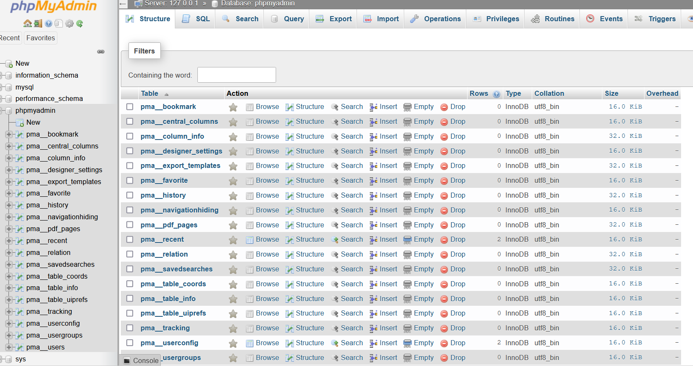

git clone https://github.com/sonnyyu/docker-phpmyadmin/

cd docker-phpmyadmin

docker-compose down -v

docker-compose up -d

https://ip:8086/

mysql> CREATE USER 'root'@'127.0.0.1' IDENTIFIED BY 'somepassword';

mysql> GRANT ALL PRIVILEGES ON *.* TO 'root'@'127.0.0.1' WITH GRANT OPTION;

mysql> FLUSH PRIVILEGES;

mysql -h 127.0.0.1  -uroot -p
